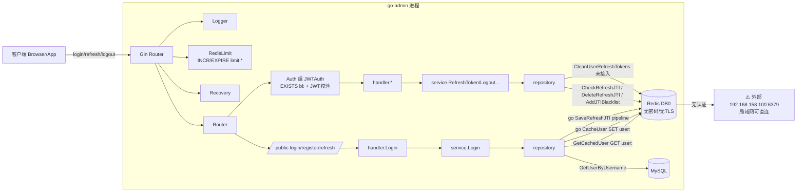

# 🔴 Redis 缓存层架构审计报告

> 审计对象：`go-admin`（JWT 双 Token 改造已完成后的第二阶段：Redis 缓存层）
>
> 审计日期：2026-08-01
>
> 审计范围：`config/redis.go`、`internal/repository/user.go`、`internal/service/user.go`、`middleware/auth.go`、`middleware/redis_limit.go`、`utils/jwt.go`、`cmd/main.go`、`docker-compose.yml`、`.env`
>
> 原则：**仅分析，不修改任何代码。**
>
> 结论速览：发现 **P0 问题 2 个**、**P1 问题 8 个**、**P2 问题 7 个**。其中 1 个 P0 是功能性 bug（缓存命中后登录必失败），1 个 P0 是安全类竞态（异步写可导致登出撤销失效）。

---

## 目录

1. [Redis 初始化层审计](#一redis-初始化层审计)
2. [Redis Key 设计审计](#二redis-key-设计审计)
3. [用户缓存设计分析](#三用户缓存设计分析)
4. [JWT Redis 管理分析](#四jwt-redis-管理分析)
5. [并发安全分析](#五并发安全分析)
6. [性能分析](#六性能分析)
7. [安全分析](#七安全分析)
8. [当前 Redis 架构图](#八当前-redis-架构图)
9. [当前 Key 表](#九当前-key-表)
10. [存在问题列表](#十存在问题列表)
11. [Redis 重构建议](#十一redis-重构建议)

---

## 一、Redis 初始化层审计

审计文件：`go-admin/config/redis.go`（全文 35 行）

```go
// 全局Redis客户端 + 上下文（整个项目统一用这一个）
var (
	RedisClient *redis.Client
	Ctx         = context.Background()
)

func InitRedis() {
	addr := os.Getenv("REDIS_ADDR")     // 例如 172.19.39.114:6379
	password := os.Getenv("REDIS_PASS") // Redis密码，如果没密码留空

	RedisClient = redis.NewClient(&redis.Options{
		Addr:     addr,
		Password: password,
		DB:       0, // 默认用DB 0
	})

	_, err := RedisClient.Ping(Ctx).Result()
	if err != nil {
		log.Fatalf("Redis连接失败: %v", err)
	}
	log.Println("Redis连接成功 ✅")
}
```

### 1.1 Client 初始化方式

| 检查项 | 结果 | 说明 |
|--------|------|------|
| 库 | `github.com/go-redis/redis/v8 v8.11.5` | 业界主流 v8 库 |
| 初始化 | `redis.NewClient(&redis.Options{...})` | 标准单机模式 Client，无 Cluster/Sentinel 支持 |
| Ping 探活 | ✅ `Ping(Ctx)` + `log.Fatalf` | **fail-fast**：连接失败直接终止进程；无重试、无降级 |

### 1.2 连接池配置 ❌ 未配置（全部使用默认值）

`redis.Options` 只设置了 `Addr / Password / DB`，连接池参数全部走 go-redis 默认值：

| 参数 | 当前值 | 默认值 | 风险 |
|------|--------|--------|------|
| `PoolSize` | 未设置 | `10 * GOMAXPROCS`（如 8 核 → 80） | 高并发下无法调优，突发流量可能 PoolTimeout |
| `MinIdleConns` | 未设置 | `0` | 空闲时连接全部回收，冷启动有握手开销 |
| `MaxConnAge` | 未设置 | `0`（永不回收） | 长连接在 LB/NAT 环境下易被服务端断掉 |
| `DialTimeout` | 未设置 | `5s` | 可用默认，但无显式语义 |
| `ReadTimeout` | 未设置 | `3s` | Redis 慢/挂起时读超时短，可能误报 |
| `PoolTimeout` | 未设置 | `1min` | 池满时最长阻塞 1 分钟 |
| `MaxRetries` | 未设置 | `3` | 写操作自动重试 3 次（幂等性需确认） |

> 风险点：没有任何环境变量（如 `REDIS_POOL_SIZE`）可以线上调优，只能改代码后重新发布。

### 1.3 密码 ⚠️ 支持但当前未启用

- ✅ 代码支持：`os.Getenv("REDIS_PASS")` 传入 `Password`
- ❌ 当前 `.env` 中 `REDIS_PASS=` 为空；`docker-compose.yml` 中 redis 服务**没有配置 `requirepass`**，且 go-admin 服务没有传递 `REDIS_PASS` 环境变量
- ❌ 结论：当前部署 Redis **完全无认证**，任何人能连上 6379 即可读写（详见第七章安全分析）

### 1.4 DB ⚠️ 硬编码为 0

```go
DB: 0, // 默认用DB 0
```

- ❌ DB 编号**写死**为 `0`，不支持 `REDIS_DB` 环境变量
- ❌ 无法通过「不同 DB」做环境隔离（dev / staging / prod 共用同一实例时 key 会互相污染）

### 1.5 环境变量配置

| 环境变量 | 是否支持 | 说明 |
|----------|----------|------|
| `REDIS_ADDR` | ✅ | 连接地址 |
| `REDIS_PASS` | ✅ | 密码 |
| `REDIS_DB` | ❌ | 无 |
| `REDIS_POOL_SIZE` / `REDIS_MIN_IDLE` | ❌ | 无 |
| `REDIS_TLS` / `REDIS_CERT` | ❌ | 无 |
| `REDIS_PREFIX`（key 前缀） | ❌ | 无 |

- ❌ 若生产环境忘记配置 `REDIS_ADDR`，则 `Addr=""`，启动即 `log.Fatalf`（fail-fast 可接受，但缺少友好报错）。

### 1.6 全局变量依赖问题 ⚠️

```go
var (
	RedisClient *redis.Client
	Ctx         = context.Background()
)
```

- ❌ `config.RedisClient` / `config.Ctx` 是包级全局变量，所有层（middleware / repository / service）直接依赖，**无法依赖注入、无法 mock、单元测试困难**（与 `config.DB` 同款问题）
- ❌ `repository` 里还另起了一个 `var ctx = context.Background()`（`internal/repository/user.go:13`），与 `config.Ctx` **重复定义、两套 context**，违反 MIGRATION_PLAN.md 中「统一 config.Ctx」的规划
- ✅ 全局变量本身 goroutine-safe（go-redis Client 可并发使用），所以这不是数据竞争问题，而是**架构耦合**问题

### 1.7 Context 使用问题 ❌

| 位置 | 使用的 context | 问题 |
|------|---------------|------|
| `config/redis.go:14` | `context.Background()` 全局单例 | 永不取消、无超时 |
| `internal/repository/user.go:13` | 独立的 `context.Background()` | 重复定义，与 config.Ctx 不一致 |
| `middleware/redis_limit.go:24` | `c.Request.Context()` | 与上面两处不一致 |

- ❌ 三处 context 来源不一致，风格混乱
- ❌ `context.Background()` 无超时：若 Redis 卡死，同步调用最多阻塞到 go-redis 内部超时（约 5s）才返回；而**异步 goroutine 里的写操作没有超时保护，可能永久挂起造成 goroutine 泄漏**
- ❌ `repository` 中的读操作没有 request-scoped context，无法随请求取消

**[返回目录](#目录)**

---

## 二、Redis Key 设计审计

### 2.1 全量 Key 清单

| # | Key 模板 | 数据类型 | TTL | 存储内容 | 写入位置 | 读取位置 | 使用目的 |
|---|----------|----------|-----|----------|----------|----------|----------|
| 1 | `user:<username>` | STRING (JSON) | 24h 固定 | 用户对象 JSON（**不含密码**，见 3.1） | `repository.CacheUser`（service.Login 内 `go` 异步） | `repository.GetCachedUser`（service.Login） | 登录快速通道缓存 |
| 2 | `rt:jti:<sha256(jti)[0:8]>` | STRING | 7d | 用户 ID（数字字符串） | `repository.SaveRefreshJTI`（login/refresh 内 `go` 异步） | `CheckRefreshJTI` / `DeleteRefreshJTI` | refresh token 有效性标记（可撤销） |
| 3 | `rt:user:<userId>` | SET | 7d（**每次 SADD 时被重置**） | 该用户所有 refresh jti 的 hash 集合 | `repository.SaveRefreshJTI`（pipeline 中 SADD + EXPIRE） | `CleanUserRefreshTokens`（**当前无任何调用方**） | 用户维度索引，便于登出/删号批量撤销 |
| 4 | `bl:<sha256(jti)[0:8]>` | STRING | access：剩余有效期（≤15min）；refresh：固定 7d | `"1"` | `repository.AddJTIBlacklist`（Logout） | `middleware/auth.go:48` `CheckJTIBlacklist` | JTI 黑名单（登出撤销） |
| 5 | `blacklist:<完整JWT字符串>` | STRING | 无 TTL（遗留数据） | `"1"` | 旧代码（已无写入方） | `CheckTokenBlacklist`（**当前无调用方**，死代码） | 旧版黑名单兼容 |
| 6 | `limit:<ClientIP \| user:<id>>:<接口路径>` | STRING (计数器) | 1min | INCR 计数 | `middleware/redis_limit.go:45` | 同一位置 | 分布式限流 |

> 备注：key #6 中 `user:<id>` 出现在 `limit:` 前缀之后，与 key #1 的 `user:<username>` 命名空间**语义冲突但不会真正碰撞**（因为多了 `limit:` 前缀），详见 2.2。

### 2.2 key 命名是否规范 ⚠️

**优点：**
- ✅ 采用 `冒号分层` 风格：`rt:jti:` / `rt:user:` / `bl:` / `user:` / `limit:`，可读性好
- ✅ 黑名单/refresh key 使用 `sha256(jti)` 前 8 字节（16 hex）做摘要，key 长度固定（16 字符），避免完整 JWT 入 key（对比旧版 `blacklist:<完整token>` 的改进已生效）
- ✅ access / refresh / blacklist / cache / limit 各自独立前缀，功能上互不干扰

**缺点：**
- ❌ **无 app / 环境前缀**：没有 `go_admin:dev:` / `go_admin:prod:` 之类的命名空间，dev 与 prod 共用 Redis 时 key 直接冲突
- ❌ 前缀风格不统一：`user:`、`rt:`、`bl:`、`blacklist:`、`limit:`，其中 `blacklist:` 是遗留命名，与 `bl:` 表达同一语义
- ❌ key 模板散落在代码里（repository 内多处字符串拼接），**没有集中常量管理**，容易手滑写错
- ❌ `rt:jti:` 与 `bl:` 使用**同一个** `utils.JTIHash` 摘要，仅靠前缀区分；前缀冲突时（如未来某功能也以 `bl:` 开头）有串读风险

### 2.3 是否存在 key 冲突风险

| 场景 | 分析 | 风险 |
|------|------|------|
| `user:<username>` 与 `limit:user:<id>:<path>` | 前缀不同，`limit:` 在前，**不碰撞** | 🟢 低 |
| `rt:jti:<hash>` 与 `bl:<hash>` | 前缀不同，不碰撞 | 🟢 低 |
| 用户名含特殊字符（空格、冒号） | 只会产生较长 key，不影响正确性；但 `user:` 前缀同时被限流子串 `user:<id>` 使用，语义易混淆 | 🟡 中 |
| JTI 碰撞：jti 为 8 字节随机（64-bit），JTIHash 截断到 64-bit | 生日悖论下约 43 亿个 key 才 50% 碰撞概率；本项目规模远达不到 | 🟢 低（但见 P2-15） |
| 不同环境共用 Redis（DB 0 写死） | dev 的 `user:test` 与 prod 的 `user:test` 完全同 key → **互踩** | 🔴 高（P1-9） |

### 2.4 是否方便删除用户所有缓存 ❌

- `user:<username>` 缓存：**无法按 userId 删除**——没有 userId → username 的反向索引；想清理只能 `SCAN user:*` 按值过滤（当前代码完全没做）
- `rt:user:<id>`：提供了按 userId 的 SET 索引，且 `CleanUserRefreshTokens` 已实现批量删除，**但没有任何调用方**（Logout / DeleteUser 都没调它）
- 改名（`EditUser`）、删号（`DeleteUser`）、改状态、改密码**均不清理任何缓存 key** → 脏数据最长存活 24h（详见 3.x）

### 2.5 是否支持多环境隔离 ❌

- 无 key 前缀、无 DB 隔离（DB=0 硬编码）、无独立实例约定
- 当前 `.env` 指向 `192.168.158.100:6379`，若 dev 与 prod 连的是同一台 Redis → **dev 登录会污染 prod 用户缓存 / 黑名单 / refresh 记录**，属于必须修复项（P1-9）

**[返回目录](#目录)**

---

## 三、用户缓存设计分析

审计代码：`internal/repository/user.go:63-85` + `internal/service/user.go:13-37` + `model/user.go`

```go
// model/user.go
Password string `gorm:"not null" json:"-" binding:"required,min=6,max=20"` // json:"-" 隐藏密码

// repository/user.go
func CacheUser(user *model.User, ttl time.Duration) {
	key := "user:" + user.Username
	data, err := json.Marshal(user)          // ⚠️ Password 字段 json:"-" → 序列化结果不含密码
	if err != nil { return }                  // ❌ 错误被静默吞掉
	config.RedisClient.Set(ctx, key, data, ttl) // ❌ 返回值被丢弃
}

func GetCachedUser(username string) (*model.User, error) {
	key := "user:" + username
	data, err := config.RedisClient.Get(ctx, key).Result()
	...
	json.Unmarshal([]byte(data), &user)        // ⚠️ 反序列化后 Password == ""
}

// service/user.go
func Login(username, password string) ... {
	if cached, err := repository.GetCachedUser(username); err == nil {   // 缓存命中
		if bcrypt.CompareHashAndPassword([]byte(cached.Password), []byte(password)) == nil {
			return generateTokenResult(cached.ID)
		}
		return nil, errors.New("密码错误")       // ❌ 缓存命中时 cached.Password 恒为空串 → 永远走到这里
	}
	... // DB 路径
	go repository.CacheUser(user, 24*time.Hour) // ❌ 异步写，错误不可见
}
```

### 3.1 🔴 缓存内容是否合理 —— 【P0-1】缓存命中后登录必失败（功能损坏）

**根因链路：**

1. `model.User.Password` 声明了 `json:"-"`（`model/user.go:9`），其本意是让 HTTP 响应不返回密码；
2. 但 `CacheUser` 用 `json.Marshal(user)` 缓存时，**同样遵守该 tag** → Redis 里的缓存值**不包含 password 字段**；
3. `GetCachedUser` 反序列化后 `cached.Password == ""`；
4. `service.Login` 在缓存命中分支执行 `bcrypt.CompareHashAndPassword([]byte(""), []byte(password))` → bcrypt 对空哈希必然返回 `hashedSecret too short` 错误 → 恒走 `return nil, errors.New("密码错误")`；
5. 由于 `CacheUser` 在首次登录成功后毫秒级完成异步写入，**该用户 24h 内的所有后续登录都会命中缓存并报"密码错误"**。

**影响：** 登录功能在缓存存在期间完全不可用，属于功能性 P0 bug。用户第一次能登录，之后 24h 内全部登录失败；且日志无任何提示（错误被 `err == nil` 判断掩盖、Set 返回值被丢弃）。

**顺带的安全影响：** 反过来说，正因为 `json:"-"`，bcrypt 密码哈希**没有**进 Redis（这是好事），问题的本质是**登录逻辑错误地依赖缓存做密码校验**，而缓存又不该存密码。修复方向见第十一章建议 1。

### 3.2 是否缓存密码字段

- ❌ 缓存的 JSON 中**不含密码字段**（`json:"-"` 生效）
- ✅ 客观上避免了 bcrypt 哈希进 Redis 的泄露风险
- ⚠️ 但这也直接导致了 P0-1：缓存命中后无法做密码校验。缓存与登录校验两个职责被错误耦合

### 3.3 TTL 是否合理

| 参数 | 当前值 | 评价 |
|------|--------|------|
| `user:<username>` TTL | 固定 24h | 对「登录校验缓存」而言过长；且**无随机抖动**，批量写入时存在雪崩隐患（见 3.5） |
| 与 refresh token 7d / access 15min 的关系 | 无关联 | 缓存生命周期独立于 token 生命周期，刷新 token 后用户信息可能已过期 |

### 3.4 是否存在缓存穿透 ⚠️

- ❌ **无负面缓存**：不存在的用户名不会写入任何缓存 → 攻击者反复用随机用户名调 `/api/user/login`，每次都会穿透到 MySQL（虽然限流中间件按 IP 兜底 60 次/分钟，但穿透成本依然存在）
- ✅ 穿透时错误路径安全：`GetCachedUser` 返回 error → 回落到 DB，不会把错误当成功

### 3.5 是否存在缓存雪崩 ⚠️

- 每个用户首次登录的时间不同，24h 固定 TTL 的 key 会错峰过期，**天然雪崩概率低**；
- 但若上线新功能导致大面积缓存集中写入（例如历史数据预热），无抖动 TTL 会集中过期 → **建议加 ±随机抖动**（P2-13）。

### 3.6 是否存在缓存击穿 ⚠️

- 热门用户（如 admin）的缓存 key 过期瞬间，若同时涌入大量登录请求 → 全部穿透到 MySQL；
- 当前**没有 single-flight / 互斥锁（SetNX）** 防护；
- 规模小时影响可忽略，规模大（10 万用户）时建议加（P1-8 建议）。

### 3.7 无缓存失效机制 ❌（P1-7）

- `UpdateUserPassword`（改密码）、`UpdateUserStatus`（改状态）、`DeleteUser`（删号）、`EditUser`（改名/改状态）**都不清理 `user:<username>` 缓存**；
- 结果：改密码后旧缓存继续存在（虽然 P0-1 下缓存命中本来就会失败，但若 P0 修复后仍无失效机制，脏数据将直接影响登录/查询）；
- 尤其「改名」：旧 key `user:<旧名>` 永久残留直到 24h TTL。

**[返回目录](#目录)**

---

## 四、JWT Redis 管理分析

审计代码：`internal/repository/user.go:87-165` + `internal/service/user.go:39-101,133-151` + `utils/jwt.go`

```go
// SaveRefreshJTI —— 保存 refresh jti
key := "rt:jti:" + utils.JTIHash(jti)
pipe := config.RedisClient.Pipeline()
pipe.Set(ctx, key, userId, ttl)
pipe.SAdd(ctx, fmt.Sprintf("rt:user:%d", userId), utils.JTIHash(jti))
pipe.Expire(ctx, fmt.Sprintf("rt:user:%d", userId), ttl)
_, err := pipe.Exec(ctx)
```

```go
// RefreshToken 刷新流程（service/user.go:63-101）
1. claims, _ := utils.ParseRefreshToken(refreshTokenStr)
2. valid, err := repository.CheckRefreshJTI(claims.JTI)   // EXISTS rt:jti:<hash>
3. repository.DeleteRefreshJTI(claims.JTI)                 // DEL rt:jti:<hash>
4. 生成新的 access/refresh
5. go repository.SaveRefreshJTI(...)                       // ⚠️ 异步写新 jti
```

### 4.1 refresh token 是否真正可撤销 ✅（有，但不完备）

- ✅ 登出时 `DeleteRefreshJTI` 删除 `rt:jti:<hash>`；刷新时也先删旧 jti → 已删除的 jti 无法通过 `CheckRefreshJTI`，**基础撤销能力成立**
- ✅ 同时加入 `bl:<hash>` 黑名单做第二道防线
- ⚠️ 但存在**异步写复活竞态**（见 5.1）：登出紧跟在登录之后时，异步 SaveRefreshJTI 可能把已删除的 key 重新写回 → **撤销被绕过**

### 4.2 rotation 是否安全 ❌（P1-5）

- ❌ **非原子**：`CheckRefreshJTI`（检查）→ `DeleteRefreshJTI`（删除）→ `SaveRefreshJTI`（写入，且是异步 `go`）三步分离，**不存在"检查并删除"的原子操作**
- ❌ **并发重用无法检测**：同一 refresh token 被两个并发请求同时提交时，两者都能通过 EXISTS 检查、都能删除、都能生成新 token → **同一旧 token 可换取两个新 token**，refresh token 不再是严格单次使用（reuse detection 缺失）
- ❌ **删除与写入分离**：`DeleteRefreshJTI` 成功后、异步 `SaveRefreshJTI` 失败或进程崩溃 → 旧 token 已失效、新 token 未持久化 → **用户被强制登出**，无法自愈
- ✅ 旋转方向正确（每次 refresh 都换新 jti + 旧 jti 删除），只是实现上需要原子化

### 4.3 Redis 数据结构是否合理 ⚠️

| 结构 | 评价 |
|------|------|
| `rt:jti:<hash>` = STRING(userId) | ✅ 合理；O(1) 存在性判断。可扩展为存储签发时间/IP 做审计（长期规划） |
| `rt:user:<id>` = SET | ⚠️ 思路正确（用户维度批量撤销），但成员**只增不减**（见 4.5） |
| `bl:<hash>` = STRING("1") | ✅ 合理 |
| `limit:*` = STRING 计数器 | ✅ 合理，配合 INCR |

### 4.4 TTL 是否正确 ⚠️

| key | 当前 TTL | 正确性 |
|-----|----------|--------|
| `rt:jti:<hash>` | 7d 固定 | ✅ 与 refresh token 有效期（7d）一致 |
| `rt:user:<id>` | 每次 SADD 时被重置为 7d | ⚠️ 见 4.5：滑动窗口导致集合永不消亡 |
| `bl:<hash>`（access） | `time.Until(exp)` 剩余有效期 | ✅ 正确（≤15min） |
| `bl:<hash>`（refresh） | 固定 7d | ⚠️ 过宽：refresh 剩余有效期可能只剩 1 天，却写 7d 黑名单 → 内存浪费 + 潜在误伤（P2 级） |
| `blacklist:<完整token>` | 无 | ❌ 遗留无 TTL key |

### 4.5 是否存在垃圾 key ❌（P1-6）

- ❌ **`rt:user:<id>` 集合成员只增不减**：
  - `SaveRefreshJTI` 每次都 `SADD` 新 jti hash，并**重置整个集合的 TTL 为 7d**；
  - `DeleteRefreshJTI` / rotation 只删 `rt:jti:<hash>`，**从不 `SREM` 集合成员**；
  - `CleanUserRefreshTokens` 实现了整组清理，但**从未被调用**（Logout、DeleteUser 都没接）；
  - 结果：活跃用户只要持续登录/刷新，7d 滑动窗口就永远不关窗，集合里累积**大量已失效的 jti hash**，长期运行内存只增不减 → 典型的垃圾 key 累积
- ❌ `blacklist:<完整token>` 遗留 key（旧格式）无清理
- ❌ access token 没有写入 Redis 正索引（可接受的设计决策，不列为问题，但意味着 access 撤销只能靠 15min 黑名单）

**[返回目录](#目录)**

---

## 五、并发安全分析

### 5.1 竞态条件

| # | 场景 | 代码位置 | 分析 | 等级 |
|---|------|----------|------|------|
| 1 | **登出 → 异步写复活** | `service/user.go:33,52`（异步写）vs `Login/Logout`（同步删） | 登录返回后 `SaveRefreshJTI` 在后台执行；用户紧接着登出，`DeleteRefreshJTI` 先删掉 key，随后后台 `SET` 又把 `rt:jti:<hash>` 写回来 → **已撤销的 refresh token 复活**；且 refresh 流程只查 `rt:jti` 不查 `bl:`，撤销被完全绕过 | 🔴 **P0** |
| 2 | **refresh 并发重用** | `service/user.go:71-93` | 检查与删除非原子，两个并发刷新同时通过 → 双 token 同时有效 | 🟠 P1 |
| 3 | **refresh 写丢失** | `service/user.go:93` | `DeleteRefreshJTI` 成功、异步 `SaveRefreshJTI` 失败 → 新 token 无效，用户被登出 | 🟠 P1 |
| 4 | **CleanUserRefreshTokens 与新写入竞态** | `repository/user.go:152-165` | SMembers → pipeline Del 之间若有新 SADD，新 jti 要么残留、要么孤儿 | 🟡 P2 |
| 5 | **CacheUser 与更新竞态** | `service/user.go:33` | 缓存写入使用旧数据快照，覆盖并发更新的新值（叠加无失效机制） | 🟡 P2 |
| 6 | **限流 INCR + EXPIRE 非原子** | `middleware/redis_limit.go:45,57` | count==1 时 Expire；若 Expire 失败，key 无 TTL 永久残留 | 🟡 P2 |

### 5.2 goroutine 异步写 Redis 是否安全

- ✅ **go-redis Client 本身 goroutine-safe**（连接池复用），并发调用 Set/Get/Del 不会 panic，不存在 Go 数据竞争
- ❌ **业务层面不安全**：`go repository.CacheUser(...)` 与 `go repository.SaveRefreshJTI(...)` 都是 fire-and-forget：
  - 错误被完全吞掉（无日志、无重试、无告警）；
  - **顺序无法保证**：异步写与同步删/改之间没有 happens-before，直接导致 5.1 中的竞态 1；
  - 异步 goroutine 使用无超时的 `context.Background()`，Redis 挂起时 goroutine 泄漏
- ❌ 结论：**"登录成功但缓存未写入 / refresh 未持久化"是当前代码的高概率事件**——Redis 抖动一次，用户的 refresh token 就变成废票，且无任何补偿

### 5.3 是否需要事务 / Pipeline

- ✅ **Pipeline 已用对地方**：`SaveRefreshJTI` 的 `SET + SADD + EXPIRE` 用 Pipeline 合并为一次 RTT，正确且高效（但 Pipeline 不保证原子性，只保证批发送）
- ❌ **真正需要原子性的地方没用**：
  - refresh rotation 的「检查+删除+写入」应改用 **Lua 脚本** 或 **`GETDEL` + 返回值判断**，实现单次原子消费；
  - 限流的 INCR+EXPIRE 应改用 Lua 或 `SET key 1 NX EX` 模式
- ⚠️ `CleanUserRefreshTokens` 用 Pipeline 批量 Del，方向正确，但调用时机缺失（4.5）

**[返回目录](#目录)**

---

## 六、性能分析

### 6.1 当前设计能否支撑 1000 / 10000 / 100000 用户

| 规模 | 结论 | 依据 |
|------|------|------|
| 1000 用户 | ✅ 完全没问题 | key 总量 < 1 万，内存 < 50MB，全部 O(1) 操作 |
| 10000 用户 | ✅ 没问题 | 预估 key 数万级，内存 ~100MB，单机 Redis 轻松承载 |
| 100000 用户 | ⚠️ 可支撑，但**必须先修 P0/P1** | 见下方 key 增长与内存估算；最大的风险是 `rt:user` 集合垃圾与连接池默认值 |

### 6.2 key 数量增长

| key 类型 | 增长模型 | 10 万用户估算（每日登录 1 次） |
|----------|----------|-------------------------------|
| `user:<username>` | 每活跃用户 1 个（24h TTL） | ~10 万 |
| `rt:jti:<hash>` | 每次登录+每次刷新各 1 个（7d TTL） | ~70 万（7 天窗口内 10 万×7） |
| `rt:user:<id>` | 每活跃用户 1 个 SET，**成员无上限累积** | 10 万个 SET，成员数取决于活跃时长（见 6.3） |
| `bl:<hash>` | 每次登出 1-2 个（≤15min / 7d） | 低，瞬时值 |
| `limit:*` | 每 (IP或用户)×路径×分钟 1 个（1min TTL） | 由流量决定，有 TTL 兜底 |

### 6.3 内存占用估算

假设单 key 平均开销（含 Redis dict entry + robj）约 100~150B：

| 规模 | `user:*` | `rt:jti:*` | `rt:user:*` | 合计（估算） |
|------|----------|-----------|-------------|--------------|
| 1000 | ~0.5MB | ~1MB | ~1MB | **< 5MB** |
| 10000 | ~5MB | ~10MB | ~10MB | **~30MB** |
| 100000 | ~50MB | ~100MB | 集合成员失控 → **可能数百 MB 至 GB** | **200MB ~ 1GB+（失控）** |

> ⚠️ 核心风险：`rt:user:<id>` 集合成员在 7d 滑动窗口内**只增不减**。活跃用户每登录/刷新一次就 +1 成员，一年不登出可累积数百至数千个死成员 → 10 万用户下内存可能爆炸。**这是规模化前必须修复的点**（P1-6）。

### 6.4 查询复杂度

| 操作 | 复杂度 | 说明 |
|------|--------|------|
| 登录 | O(1) | 1× GET（缓存命中）或 1× DB |
| JWT 鉴权 | O(1) | 1× EXISTS（bl） |
| 刷新 | O(1)+ | EXISTS + DEL + Pipeline(3 命令) |
| 登出 | O(1) | DEL / SET |
| `CleanUserRefreshTokens` | O(N) | SMembers + N×Del（当前未调用） |

- ✅ 全部路径 O(1) 级别，Redis 端压力很小
- ❌ 无 `SCAN` 支持的用户缓存批量删除能力（若要按用户清缓存需要额外设计）

### 6.5 是否需要优化

- **必须**：修复 P0-1（缓存逻辑损坏）、P1-6（rt:user 集合垃圾）、P1-3（连接池配置）
- **建议**：开启 `maxmemory allkeys-lru` 兜底 + `INFO`/`monitor` 监控告警
- 100k 用户量级下**不需要**分片/集群；单机 4GB 内存足够（前提是修掉集合垃圾）

**[返回目录](#目录)**

---

## 七、安全分析

### 7.1 Redis 是否暴露公网 ⚠️

- ✅ docker-compose 中 redis 服务**未映射宿主端口**，仅在 docker 内部网络可达
- ❌ `.env` 指向外部 `192.168.158.100:6379`，且 `REDIS_PASS` 为空 → **这台外部 Redis 无密码**。若它监听在非回环地址（Redis 默认配置或云厂商默认可能绑定 0.0.0.0），**局域网内任何主机都能连上并读写/FLUSHALL**
- ❌ docker-compose 的 go-admin 服务**没有配置 `environment` 指向 compose 内的 redis 服务**，而 `.dockerignore` 没有排除 `.env` → 构建时会连 `.env` 一起 COPY 进镜像，应用在容器内仍连的是宿主局域网 IP 而不是 `redis:6379`（部署配置不一致）

### 7.2 是否需要 TLS ⚠️

- ❌ go-redis `Options` 未设置 `TLSConfig`，也不支持 `REDIS_TLS` 开关
- ⚠️ 若 Redis 与业务同处可信内网，非必须；但只要经过公网/半可信网络传输（AUTH、缓存数据在途），**应启用 TLS 或至少限制来源 IP**（P1-4）

### 7.3 敏感数据是否进入 Redis

| 数据 | 是否进 Redis | 评价 |
|------|--------------|------|
| bcrypt 密码哈希 | ❌ 未进入 | ✅ `json:"-"` 使 `CacheUser` 不含密码（同时这也是 P0-1 的根因） |
| refresh token 完整字符串 | ❌ 未进入 | ✅ Redis 只存 `sha256(jti)` 摘要，泄露 Redis 也无法直接冒充（还需签名密钥） |
| 用户基本信息 | ✅ 进入 | ⚠️ username/status/时间戳会被任何能连 Redis 的人读取；可接受，但不建议存非必要字段 |
| JWT 签名密钥 | ❌ 未进入 | ✅ 在环境变量/默认常量中 |

### 7.4 refresh token 是否泄露风险

- ✅ 传输上：仅存在于 HTTP 响应体（login/refresh），Redis 只存摘要；
- ⚠️ 业务上：`RefreshToken` 无 IP/UA 绑定、无设备指纹；refresh token 一旦被中间人/前端窃取，可在 7d 内任意换新（并发重用检测缺失会放大这一点，见 4.2）；
- ⚠️ `bl:` 对 refresh 固定 7d，即使 refresh 实际剩余有效期更短，也延长了「黑名单误伤」与内存占用。

### 7.5 是否需要 hash 存储

- ✅ **已采用**：`rt:jti:` / `bl:` 都用 `utils.JTIHash`（sha256 前 8 字节 = 64-bit）而非明文 jti/token，符合最佳实践
- ⚠️ 64-bit 摘要（16 hex）在**离线拿到 Redis dump 的强攻方**面前，暴力还原 jti 的代价约 2^64 次，边界可行；建议未来提升为 128-bit（P2-15）

**[返回目录](#目录)**

---

## 八、当前 Redis 架构图



### 当前数据流要点

1. **登录**：GET `user:<name>`（缓存）→ 未命中走 MySQL → 异步写 `user:<name>` + 异步写 `rt:jti` / `rt:user` → 返回双 token
2. **鉴权**：每次请求先 `EXISTS bl:<hash>`（jti 黑名单）→ 通过后放行
3. **刷新**：`EXISTS rt:jti:<hash>` → `DEL rt:jti:<hash>` → 异步写新 jti（三步非原子）
4. **登出**：`bl:<hash>` 写入（access 用剩余 TTL / refresh 固定 7d）+ `DEL rt:jti:<hash>`；**不清理 `rt:user` 集合**

---

## 九、当前 Key 表

| Key 模板 | 类型 | TTL | 存储内容 | 用途 | 写入方 | 读取方 | 状态 |
|----------|------|-----|----------|------|--------|--------|------|
| `user:<username>` | STRING | 24h 固定 | 用户 JSON（无密码） | 登录缓存 | `CacheUser`（异步） | `GetCachedUser` | ⚠️ P0-1 |
| `rt:jti:<sha256(jti)[0:8]>` | STRING | 7d | userId | refresh 有效性 | `SaveRefreshJTI`（异步） | `CheckRefreshJTI`/`DeleteRefreshJTI` | ✅ 基础可用 |
| `rt:user:<id>` | SET | 7d（滑动重置） | jti hash 集合 | 用户维度批量撤销 | `SaveRefreshJTI` | `CleanUserRefreshTokens`（未调用） | ⚠️ P1-6 |
| `bl:<sha256(jti)[0:8]>` | STRING | access≤15min / refresh 7d | "1" | JTI 黑名单 | `AddJTIBlacklist` | `auth.go:48` | ⚠️ refresh 7d 过宽 |
| `blacklist:<完整token>` | STRING | 无 | "1" | 旧黑名单 | 无（遗留） | `CheckTokenBlacklist`（未调用） | ❌ 死代码 P2-11 |
| `limit:<IP或user:<id>>:<path>` | STRING | 1min | 计数器 | 限流 | `redis_limit.go` | 同上 | ⚠️ P2-12/16 |

**[返回目录](#目录)**

---

## 十、存在问题列表

| 问题 | 等级 | 影响 | 建议 |
|------|------|------|------|
| **P0-1** 用户缓存不含密码（`json:"-"`），缓存命中后 `bcrypt.CompareHashAndPassword("")` 恒失败 → **登录 24h 内全部报"密码错误"** | 🔴 P0 | 功能损坏：缓存写入后用户无法登录 | 登录密码校验必须走 DB；缓存只存非敏感信息，或用"密码版本号"强制失效（见建议 1） |
| **P0-2** 异步写（`go SaveRefreshJTI`）与登出/刷新的同步删除无顺序保证 → **登出后 refresh token 可被复活**；且登录成功但 Redis 写失败的场景无补偿 | 🔴 P0 | 撤销机制可被绕过 + token 丢失 | refresh 持久化改为同步+错误处理；登出用"先删后校验"；rotation 原子化（见建议 2/5） |
| **P1-3** Redis 连接池、超时、`DB`、`REDIS_DB` 全部未配置/硬编码 | 🟠 P1 | 高并发无法调优；环境无法用 DB 隔离 | 显式池配置 + 环境变量化（见建议 3） |
| **P1-4** Redis 无密码（compose 无 requirepass、`.env` 空密码）、无 TLS、外部 6379 可能局域网直连 | 🟠 P1 | 数据泄露/被恶意操作 | 开 requirepass + 内网隔离 + 可选 TLS（见建议 4） |
| **P1-5** refresh rotation 三步非原子（检查/删除/异步写），并发刷新可双活，删除后写入失败会踢人 | 🟠 P1 | token 重用、会话丢失 | Lua/GETDEL 原子消费（见建议 5） |
| **P1-6** `rt:user:<id>` 集合成员只增不减、`CleanUserRefreshTokens` 从未调用、登出不清理 | 🟠 P1 | 垃圾 key 无限累积，内存爆炸（规模化瓶颈） | rotation 时 SREM、登出接入清理（见建议 6） |
| **P1-7** 改密码/改状态/删号/改名均不失效 `user:<username>` 缓存 | 🟠 P1 | 脏数据最长存活 24h | 写操作统一清理/版本化（见建议 7） |
| **P1-8** 无负面缓存 + 无 single-flight，不存在的用户与热点 key 可穿透 MySQL | 🟠 P1 | DB 压力、缓存击穿 | 负面缓存 + 互斥锁（见建议 8） |
| **P1-9** 无 key 前缀、DB=0 硬编码 → 多环境共用 Redis 时 key 互踩 | 🟠 P1 | dev/prod 数据互相污染 | 统一前缀或按环境选 DB（见建议 9） |
| **P1-10** 三处 context 不一致且无超时（`config.Ctx` / repository 自建 / request ctx），异步写可泄漏 goroutine | 🟠 P1 | 悬挂请求、goroutine 泄漏 | 统一 context + 超时（见建议 10） |
| **P2-11** 遗留 `blacklist:<完整token>` 逻辑与 `CheckTokenBlacklist` 死代码、遗留 key 无清理 | 🟡 P2 | 内存浪费、维护负担 | 删除死代码 + 清理遗留 key |
| **P2-12** 限流 INCR+EXPIRE 非原子，Expire 失败则 key 无 TTL 永存 | 🟡 P2 | 个别 key 残留 | Lua 原子限流 |
| **P2-13** 缓存 TTL 固定 24h 无抖动 | 🟡 P2 | 集中过期雪崩隐患 | 加随机抖动 |
| **P2-14** 登录未校验用户 `status`（禁用用户仍可登录，且缓存使状态更滞后） | 🟡 P2 | 权限控制缺失 | 登录时校验 status |
| **P2-15** jti 仅 8 字节随机（64-bit）、JTIHash 截断 64-bit | 🟡 P2 | 强攻方离线碰撞边界可行 | 提升到 128-bit |
| **P2-16** `RedisLimit` 全局注册在 `JWTAuth` 之前 → `c.Get("userId")` 永远取不到，**用户级限流分支是死代码** | 🟡 P2 | 限流粒度实际只有 IP | 调整中间件顺序或延迟到鉴权后 |
| **P2-17** `user:` 前缀同时被用户缓存与限流子串使用，语义混杂；key 模板散落无集中管理 | 🟡 P2 | 可维护性 | 集中定义 key 常量 |

**[返回目录](#目录)**

---

## 十一、Redis 重构建议

### A. 必须修复（P0，影响功能与安全）

**1. 重做用户缓存登录链路（P0-1）**
- 方案 A（推荐）：`Login` 的密码校验**只走 DB**，移除对 `GetCachedUser` 的依赖；缓存仅用于"读取用户资料"类场景，且序列化 DTO 明确剔除密码；
- 方案 B：若坚持缓存做快速否决，缓存存 `passwordChangedAt`（密码版本号）+ 时间戳，命中时若版本匹配仍须回 DB 比对；**绝不把 bcrypt 哈希作为缓存比对凭据**；
- 无论哪种方案：`CacheUser` 必须改为「同步执行或异步但带重试+日志+超时」，错误必须可观测。

**2. 消除异步写竞态（P0-2）**
- `SaveRefreshJTI` 改为**同步**执行并检查错误（login/refresh 的响应正确性依赖它）；
- 登出流程改为：`DEL rt:jti` → 再 `SET bl:`（保持先删后黑名单的既有顺序）→ 在删除后**校验集合一致性**，防止被 in-flight 异步写复活；
- 如确需异步，则写入必须带 request-scoped/超时 context、失败重试与告警，且登出前用 `WaitGroup` 或写后确认。

### B. 建议优化（P1，安全与规模化）

**3. Redis 初始化增强（P1-3）**
- 显式配置 `PoolSize`、`MinIdleConns`、`MaxConnAge`、`ReadTimeout`、`WriteTimeout`、`PoolTimeout`；
- `DB` 与池参数全部环境变量化（`REDIS_DB`、`REDIS_POOL_SIZE`...）；
- 缺省值友好报错，Ping 失败可改为「告警+降级」而非直接 `log.Fatalf`。

**4. Redis 安全加固（P1-4）**
- docker-compose 中 redis 加 `command: redis-server --requirepass <强密码>` 并注入到 go-admin 的 `REDIS_PASS`；
- 应用镜像内**排除 `.env`**（`.dockerignore` 加入 `.env`），compose 统一通过 `environment` 注入；
- 生产 Redis 只允许业务网段访问；如需跨网络则启用 TLS（`tls.Config` + `REDIS_TLS`）。

**5. Rotation 原子化（P1-5）**
- 用 Lua 脚本实现「检查存在 → 删除 → 写新」三步原子；或利用 `DEL` 返回值：`DEL` 返回 0 即判定为 reuse（旧 token 已被消费）→ 拒绝并告警；
- 新 jti 写入与旧 jti 删除必须同一事务/脚本内完成，杜绝"删除成功但写入失败"窗口。

**6. 修复 `rt:user:<id>` 垃圾累积（P1-6）**
- rotation/登出时同步 `SREM` 对应 jti hash；
- 将 `CleanUserRefreshTokens` 接入 `Logout` 与 `DeleteUser`（当前纯死代码）；
- 或改用带 TTL 的独立索引（如 hash 过期扫描）替代无界 SET；
- 增加容量/成员数监控告警。

**7. 缓存失效策略（P1-7）**
- 在 `UpdateUserPassword`、`UpdateUserStatus`、`DeleteUser`、`EditUser` 中删除对应 `user:<username>` 缓存；
- 建立 userId → username 映射或在写路径通过 ID 反查用户名后 DEL。

**8. 防穿透/防击穿（P1-8）**
- 对不存在的用户名写短 TTL 负面缓存（如 60s）；
- 热点 key 用 SetNX 互斥 + 回源填充，防击穿。

**9. 多环境隔离（P1-9）**
- 所有 key 加统一前缀：`<app>:<env>:`（如 `go_admin:prod:`）；
- 或通过 `REDIS_DB` 环境变量按环境隔离 DB。

**10. Context 统一（P1-10）**
- 删除 repository 自建 `ctx`，统一使用 `config.Ctx` 或 request context；
- 所有 Redis 调用显式带超时；异步写使用带超时的 context。

### C. 长期规划（P2+）

- **11** 删除 `CheckTokenBlacklist` 与 `blacklist:*` 遗留逻辑，编写清理脚本清理存量 key；
- **12** 限流改 Lua 原子脚本；调整中间件顺序让 `RedisLimit` 能拿到 userId（或把限流判断移到鉴权之后），修复用户级限流失效问题；
- **13** 缓存 TTL 加 ±20% 随机抖动；对 `user:*` 缓存 TTL 按场景区分（登录验证类与资料类不同）；
- **14** 登录增加 `status` 校验；`bl:` 对 refresh 用剩余有效期而非固定 7d；
- **15** jti 扩展到 16 字节（128-bit），JTIHash 取满 32 hex 或保持截断但注明决策；
- **16** Redis key 模板集中为常量（如 `const keyUserCache = "user:%s"`），杜绝散落字符串；
- **17** 建立 Redis 可观测性：`INFO` 采集、`maxmemory allkeys-lru` 兜底、慢日志告警、key 数量趋势监控。

---

### 附：关于"1000 / 10000 / 100000 用户"的最终结论

- **1000**：当前实现可跑，但 P0-1 会让登录功能实际不可用，**必须先修**；
- **10000**：修复 P0 后即可稳定运行，无需额外架构；
- **100000**：需要先完成 B 部分（连接池、集合清理、缓存失效、安全加固），并加监控；**不需要** Redis 集群，单机 + 合理容量即可支撑。

---

*本报告仅做静态代码与配置审计，未修改任何业务代码。*
